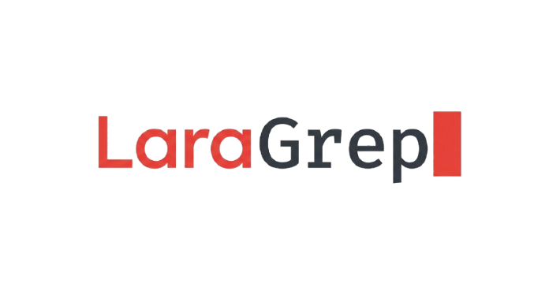

<p align="center">
  
</p>

<p align="center">
  <a href="https://packagist.org/packages/behindsolution/laragrep"></a>
  <a href="https://github.com/behindSolution/laragrep/actions/workflows/tests.yml"></a>
</p>

<p align="center">
  Transform natural language questions into safe, parameterized SQL queries using AI.<br>
  LaraGrep uses an <strong>agent loop</strong> — the AI executes queries, sees the results,<br>
  and iteratively reasons until it can provide a final answer.
</p>

---

## Quick Start

### 1. Install

```bash
composer require behindsolution/laragrep
```

### 2. Publish config and migrations

```bash
php artisan vendor:publish --tag=laragrep-config
php artisan vendor:publish --tag=laragrep-migrations
```

### 3. Create the SQLite database and run migrations

LaraGrep stores conversations, monitor logs, and recipes in a separate SQLite database by default, keeping everything isolated from your main database.

Create the file and run migrations:

```bash
# Linux / macOS
touch database/laragrep.sqlite

# Windows
type nul > database\laragrep.sqlite
```

Add a `laragrep` connection to your `config/database.php`:

```php
'connections' => [
    // ... your existing connections

    'laragrep' => [
        'driver' => 'sqlite',
        'database' => database_path('laragrep.sqlite'),
        'foreign_key_constraints' => true,
    ],
],
```

Then point LaraGrep to it in your `.env`:

```env
LARAGREP_CONVERSATION_CONNECTION=laragrep
LARAGREP_MONITOR_CONNECTION=laragrep
LARAGREP_RECIPES_CONNECTION=laragrep
```

Run the migrations:

```bash
php artisan migrate
```

> Already using SQLite as your main database? You can skip the connection setup — LaraGrep will use the default `sqlite` connection as-is.

### 4. Add your API key to `.env`

```env
LARAGREP_PROVIDER=openai
LARAGREP_API_KEY=sk-...
LARAGREP_MODEL=gpt-4o-mini
```

### 5. Define your tables in `config/laragrep.php`

```php
use LaraGrep\Config\Table;
use LaraGrep\Config\Column;
use LaraGrep\Config\Relationship;

'contexts' => [
    'default' => [
        // ...
        'tables' => [
            Table::make('users')
                ->description('Registered users.')
                ->columns([
                    Column::id(),
                    Column::string('name'),
                    Column::string('email'),
                    Column::timestamp('created_at'),
                ]),

            Table::make('orders')
                ->description('Customer orders.')
                ->columns([
                    Column::id(),
                    Column::bigInteger('user_id')->unsigned(),
                    Column::decimal('total', 10, 2),
                    Column::enum('status', ['pending', 'paid', 'cancelled']),
                    Column::timestamp('created_at'),
                ])
                ->relationships([
                    Relationship::belongsTo('users', 'user_id'),
                ]),
        ],
    ],
],
```

### 6. Ask your first question

```bash
curl -X POST http://localhost/laragrep \
  -H "Content-Type: application/json" \
  -d '{"question": "How many users registered this week?"}'
```

```json
{
    "summary": "There were 42 new registrations this week.",
    "conversation_id": "550e8400-e29b-41d4-a716-446655440000"
}
```

That's it. LaraGrep validates, executes, and answers automatically.

---

## Monitor

LaraGrep includes a built-in monitoring dashboard. Enable it to track every query, error, token usage, and performance metric.

### Enable

```env
LARAGREP_MONITOR_ENABLED=true
```

Access the dashboard at **`GET /laragrep/monitor`**:

- **Logs** — Filterable list of all queries with status, duration, iterations, and token estimates
- **Overview** — Aggregate stats: success rate, errors, token usage, daily charts, top scopes
- **Detail** — Full agent loop trace for each query: SQL, bindings, results, AI reasoning

Protect it with middleware:

```php
// config/laragrep.php
'monitor' => [
    'enabled' => true,
    'middleware' => ['auth:sanctum'],
],
```

---

## Async Mode

The agent loop can take 30-100+ seconds with multiple iterations, easily exceeding PHP or Nginx timeouts. Async mode dispatches the processing to a queue job and returns immediately.

### Enable

```env
LARAGREP_ASYNC_ENABLED=true
LARAGREP_ASYNC_QUEUE_CONNECTION=redis
```

Requires a real queue driver (`redis`, `database`, `sqs`, etc.). LaraGrep will throw an exception at boot if the queue connection uses the `sync` driver.

When enabled, **all requests** become async — the frontend doesn't decide, the backend does.

### How It Works

```
POST /laragrep { "question": "..." }

-> 202 Accepted
{
    "query_id": "550e8400-e29b-41d4-a716-446655440000",
    "channel": "laragrep.550e8400-e29b-41d4-a716-446655440000"
}
```

The agent loop runs in a background job. When it finishes, the result is delivered via **broadcasting** (WebSocket) and/or **polling** (GET endpoint).

### Polling

```bash
GET /laragrep/queries/{query_id}
```

Returns the current status:

```json
{ "status": "processing" }
```

While the AI is working, the response includes a progress message describing the current step:

```json
{ "status": "processing", "progress": "Counting users registered this week" }
```

Or when completed:

```json
{
    "status": "completed",
    "summary": "There were 42 new registrations this week.",
    "conversation_id": "...",
    "recipe_id": 42
}
```

Or on failure:

```json
{ "status": "failed", "error": "Sorry, something went wrong..." }
```

### Broadcasting (Optional)

If you have Laravel broadcasting configured (Reverb, Pusher, Soketi, Ably), LaraGrep broadcasts two events on the channel returned in the response:

| Event | Payload |
|---|---|
| `laragrep.answer.progress` | `queryId`, `iteration`, `message` |
| `laragrep.answer.ready` | `queryId`, `summary`, `conversationId`, `recipeId` |
| `laragrep.answer.failed` | `queryId`, `error` |

**Frontend example (Laravel Echo):**

```js
Echo.channel(response.channel)
    .listen('.laragrep.answer.progress', (e) => {
        showProgress(e.message); // "Counting users registered this week"
    })
    .listen('.laragrep.answer.ready', (e) => {
        showAnswer(e.summary);
    })
    .listen('.laragrep.answer.failed', (e) => {
        showError(e.error);
    });
```

For private channels, set `LARAGREP_ASYNC_PRIVATE=true` and register the channel authorization in your `routes/channels.php`:

```php
Broadcast::channel('laragrep.{queryId}', function ($user, $queryId) {
    return true; // your authorization logic
});
```

Broadcasting is entirely optional — polling via GET works without any broadcasting setup. If you only want polling, make sure broadcasting is disabled in your `.env`:

```env
BROADCAST_CONNECTION=null
```

### Completed records cleanup

Async records are automatically cleaned up after 24 hours (configurable via `LARAGREP_ASYNC_RETENTION_HOURS`).

---

## How It Works

Unlike simple text-to-SQL tools, LaraGrep uses an **agent loop**:

1. You ask a question in natural language
2. The AI analyzes the schema and decides which queries to run
3. LaraGrep validates and executes the queries safely
4. The AI sees the results and decides: run more queries, or provide the final answer
5. Repeat until the AI has enough data to answer (up to `max_iterations`)

This means the AI can build on previous results, self-correct, break down complex analysis into steps, and batch independent queries in a single iteration.

```
"How many users and how many orders do I have?"

  -> AI: Sends 2 queries in one batch (independent)        (1 API call)
  -> AI: Sees both results, provides the final answer       (1 API call)
```

---

## Configuration

### AI Provider

**OpenAI:**

```env
LARAGREP_PROVIDER=openai
LARAGREP_API_KEY=sk-...
LARAGREP_MODEL=gpt-4o-mini
```

**Anthropic:**

```env
LARAGREP_PROVIDER=anthropic
LARAGREP_API_KEY=sk-ant-...
LARAGREP_MODEL=claude-sonnet-4-20250514
```

**Ollama (local):**

```env
LARAGREP_PROVIDER=openai
LARAGREP_API_KEY=ollama
LARAGREP_MODEL=qwen3-coder:30b
LARAGREP_BASE_URL=http://localhost:11434/v1/chat/completions
```

Ollama exposes an OpenAI-compatible API, so it works with the `openai` provider. The API key can be any non-empty string. This keeps your data fully local.

### Fallback Provider

If the primary provider fails (timeout, rate limit, API down), LaraGrep can automatically retry with a fallback:

```env
LARAGREP_FALLBACK_PROVIDER=anthropic
LARAGREP_FALLBACK_API_KEY=sk-ant-...
LARAGREP_FALLBACK_MODEL=claude-sonnet-4-20250514
```

Works in any direction — OpenAI primary with Anthropic fallback, or vice versa. When the primary succeeds, the fallback is never called. No cooldown, no circuit breaker — just tries in order.

### Schema Loading Mode

| Mode     | Behavior                                              |
|----------|-------------------------------------------------------|
| `manual` | Only use tables defined in config (default)           |
| `auto`   | Auto-load from `information_schema` (MySQL/MariaDB/PostgreSQL) |
| `merged` | Auto-load first, then overlay config definitions      |

```env
LARAGREP_SCHEMA_MODE=manual
```

- **manual** is the safest — no accidental schema exposure.
- **auto** is ideal for quick setup when all tables are fair game.
- **merged** lets you auto-load and then add descriptions, relationships, or extra tables on top.

### Table Definitions

Define tables using fluent classes with IDE autocomplete:

```php
use LaraGrep\Config\Table;
use LaraGrep\Config\Column;
use LaraGrep\Config\Relationship;

Table::make('orders')
    ->description('Customer orders.')
    ->columns([
        Column::id(),
        Column::bigInteger('user_id')->unsigned()->description('FK to users.id.'),
        Column::decimal('total', 10, 2)->description('Order total.'),
        Column::enum('status', ['pending', 'paid', 'cancelled']),
        Column::json('metadata')
            ->description('Order metadata')
            ->template(['shipping_method' => 'express', 'tracking_code' => 'BR123456789']),
        Column::timestamp('created_at'),
    ])
    ->relationships([
        Relationship::belongsTo('users', 'user_id'),
    ]),
```

**Supported column types:** `id()`, `bigInteger()`, `integer()`, `smallInteger()`, `tinyInteger()`, `string()`, `text()`, `decimal()`, `float()`, `boolean()`, `date()`, `dateTime()`, `timestamp()`, `json()`, `enum()`.

**Modifiers:** `->unsigned()`, `->nullable()`, `->description()`.

For JSON columns, `->template()` provides an example structure so the AI knows how to query with `JSON_EXTRACT`.

#### Organizing Large Schemas

For projects with many tables, extract each definition into its own class:

```php
// app/LaraGrep/Tables/OrdersTable.php
namespace App\LaraGrep\Tables;

use LaraGrep\Config\Table;
use LaraGrep\Config\Column;
use LaraGrep\Config\Relationship;

class OrdersTable
{
    public static function define(): Table
    {
        return Table::make('orders')
            ->description('Customer orders.')
            ->columns([
                Column::id(),
                Column::bigInteger('user_id')->unsigned(),
                Column::decimal('total', 10, 2),
                Column::timestamp('created_at'),
            ])
            ->relationships([
                Relationship::belongsTo('users', 'user_id'),
            ]);
    }
}
```

```php
// config/laragrep.php
'tables' => [
    \App\LaraGrep\Tables\UsersTable::define(),
    \App\LaraGrep\Tables\OrdersTable::define(),
    \App\LaraGrep\Tables\ProductsTable::define(),
],
```

### Named Scopes (Contexts)

Work with multiple databases or table sets:

```php
'contexts' => [
    'default' => [
        'connection' => env('LARAGREP_CONNECTION'),
        'tables' => [...],
    ],
    'analytics' => [
        'connection' => 'analytics_db',
        'schema_mode' => 'auto',
        'database' => ['type' => 'MariaDB 10.6', 'name' => 'analytics'],
        'exclude_tables' => ['migrations', 'jobs'],
    ],
],
```

Select a scope via the URL: `POST /laragrep/analytics`

### Query Protection

```env
LARAGREP_MAX_ROWS=20
LARAGREP_MAX_QUERY_TIME=3
```

- **max_rows** — Automatically injects `LIMIT` into queries that don't have one. Default: `20`. Set to `0` to disable.
- **max_query_time** — Maximum execution time per query in seconds. Kills slow queries before they block the database. Default: `3`. Supports MySQL, MariaDB, PostgreSQL, and SQLite.

### Agent Loop

```env
LARAGREP_MAX_ITERATIONS=10
```

Simple questions typically resolve in 1-2 iterations. Complex analytical questions may need more. Higher values increase capability but also cost.

### Smart Schema

For large databases, LaraGrep can make an initial AI call to identify only the relevant tables, reducing token usage across all iterations.

```env
LARAGREP_SMART_SCHEMA=20
```

Activates automatically when the table count reaches the threshold. With 200 tables and only 5 relevant, this reduces token usage by ~60%.

### Conversation Persistence

Multi-turn conversations are enabled by default. Previous questions and answers are sent as context for follow-ups.

```env
LARAGREP_CONVERSATION_ENABLED=true
LARAGREP_CONVERSATION_CONNECTION=sqlite
LARAGREP_CONVERSATION_MAX_MESSAGES=10
LARAGREP_CONVERSATION_RETENTION_DAYS=10
```

### Route Protection

```php
'route' => [
    'prefix' => 'laragrep',
    'middleware' => ['auth:sanctum'],
],
```

---

## Usage

### API Endpoint

```
POST /laragrep/{scope?}
```

**Basic request:**

```bash
curl -X POST http://localhost/laragrep \
  -H "Content-Type: application/json" \
  -d '{"question": "How many users registered this week?"}'
```

**With authentication and options:**

```bash
curl -X POST http://localhost/laragrep \
  -H "Content-Type: application/json" \
  -H "Authorization: Bearer YOUR_TOKEN" \
  -d '{
    "question": "How many users registered this week?",
    "conversation_id": "optional-uuid-for-follow-ups",
    "debug": true
  }'
```

**Using a named scope:**

```bash
curl -X POST http://localhost/laragrep/analytics \
  -H "Content-Type: application/json" \
  -d '{"question": "What are the top 5 products by revenue?"}'
```

**Debug response** (when `debug: true`):

```json
{
    "summary": "There were 42 new registrations this week.",
    "conversation_id": "550e8400-e29b-41d4-a716-446655440000",
    "steps": [
        {
            "query": "SELECT COUNT(*) as total FROM users WHERE created_at >= ?",
            "bindings": ["2025-01-20"],
            "results": [{"total": 42}],
            "reason": "Counting users registered in the current week"
        }
    ],
    "debug": {
        "queries": [
            {"query": "SELECT COUNT(*) ...", "bindings": ["..."], "time": 1.23}
        ],
        "iterations": 1
    }
}
```

### Programmatic Usage

```php
use LaraGrep\LaraGrep;

$laraGrep = app(LaraGrep::class);

$answer = $laraGrep->answerQuestion(
    question: 'How many orders were placed today?',
    scope: 'default',
);

echo $answer['summary'];
```

### Formatting Results

Use `formatResult()` to transform raw query results into structured formats via AI.

**Query format** — a single consolidated SQL query for export:

```php
$answer = $laraGrep->answerQuestion('Weekly sales by region');

$result = $laraGrep->formatResult($answer, 'query');
// [
//     'title' => 'Weekly Sales by Region',
//     'headers' => ['Region', 'Total Sales', 'Order Count'],
//     'query' => 'SELECT r.name as region, SUM(o.total) ... GROUP BY r.name',
//     'bindings' => ['2026-02-01'],
// ]
```

Returns the SQL itself, no `LIMIT`. Use it with Laravel's streaming tools:

```php
// Stream with cursor
foreach (DB::cursor($result['query'], $result['bindings']) as $row) {
    // process row
}

// Chunk for batch processing
DB::table(DB::raw("({$result['query']}) as sub"))
    ->setBindings($result['bindings'])
    ->chunk(1000, function ($rows) {
        // process chunk
    });
```

**Notification format** — ready-to-render content for email, Slack, or webhooks:

```php
$notification = $laraGrep->formatResult($answer, 'notification');
// [
//     'title' => 'Weekly Sales Report',
//     'html' => '<p>Sales this week totaled...</p><table>...</table>',
//     'text' => 'Sales this week totaled...\nProduct | Revenue...',
// ]
```

### Saved Queries (Recipes)

Auto-save a "recipe" after each answer — the question, scope, and queries that worked. The response includes a `recipe_id` for exports, notifications, or scheduled re-execution.

**Enable:**

```env
LARAGREP_RECIPES_ENABLED=true
```

After enabling, publish and run the migration for the `laragrep_recipes` table.

**API response with recipe:**

```json
{
    "summary": "Sales this week totaled...",
    "conversation_id": "uuid",
    "recipe_id": 42
}
```

**Dispatch a recipe:**

```bash
curl -X POST http://localhost/laragrep/recipes/42/dispatch \
  -H "Content-Type: application/json" \
  -d '{"format": "notification", "period": "now"}'
```

The `period` parameter controls timing:
- `"now"` — immediate execution (default)
- `"2026-02-10 08:00:00"` — scheduled for a specific date/time

LaraGrep fires a `RecipeDispatched` event. Your app handles the rest via a listener:

```php
// app/Listeners/HandleRecipeDispatch.php
use LaraGrep\Events\RecipeDispatched;

public function handle(RecipeDispatched $event)
{
    $job = new ProcessRecipeJob($event->recipe, $event->format, $event->userId);

    if ($event->period === 'now') {
        dispatch($job);
    } else {
        dispatch($job)->delay(Carbon::parse($event->period));
    }
}
```

```php
// app/Jobs/ProcessRecipeJob.php
use LaraGrep\LaraGrep;

public function handle(LaraGrep $laraGrep)
{
    $answer = $laraGrep->replayRecipe($this->recipe);
    $result = $laraGrep->formatResult($answer, $this->format);

    // Send email, generate Excel, post to Slack, etc.
}
```

**Programmatic usage:**

```php
use LaraGrep\LaraGrep;

$laraGrep = app(LaraGrep::class);

// First run
$answer = $laraGrep->answerQuestion('Weekly sales by region');
$recipe = $laraGrep->extractRecipe($answer, 'Weekly sales by region', 'default');

// Later — replay with fresh data
$freshAnswer = $laraGrep->replayRecipe($recipe);
$notification = $laraGrep->formatResult($freshAnswer, 'notification');
```

> **With monitor enabled?** Inject `LaraGrep\Monitor\MonitorRecorder` instead of `LaraGrep`. It wraps the same methods (`answerQuestion`, `replayRecipe`, `formatResult`) and automatically records every execution in the dashboard. When the monitor is disabled, `MonitorRecorder` resolves to `null` — so use `LaraGrep` as the safe default.

---

## Extending

### Custom AI Client

Implement `LaraGrep\Contracts\AiClientInterface` and rebind in a service provider:

```php
$this->app->singleton(AiClientInterface::class, fn () => new MyCustomClient());
```

### Custom Metadata Loader

LaraGrep auto-detects MySQL/MariaDB and PostgreSQL. For other databases, implement `LaraGrep\Contracts\MetadataLoaderInterface`:

```php
$this->app->singleton(MetadataLoaderInterface::class, fn ($app) => new MySqliteSchemaLoader($app['db']));
```

### Custom Conversation Store

Implement `LaraGrep\Contracts\ConversationStoreInterface` for Redis, file-based storage, etc.:

```php
$this->app->singleton(ConversationStoreInterface::class, fn () => new RedisConversationStore());
```

---

## Environment Variables

| Variable | Default | Description |
|---|---|---|
| `LARAGREP_PROVIDER` | `openai` | AI provider (`openai`, `anthropic`) |
| `LARAGREP_API_KEY` | — | API key for the AI provider |
| `LARAGREP_MODEL` | `gpt-4o-mini` | Model identifier |
| `LARAGREP_BASE_URL` | — | Override API endpoint URL |
| `LARAGREP_MAX_TOKENS` | `1024` | Max response tokens |
| `LARAGREP_TIMEOUT` | `300` | HTTP timeout in seconds |
| `LARAGREP_FALLBACK_PROVIDER` | — | Fallback AI provider |
| `LARAGREP_FALLBACK_API_KEY` | — | Fallback API key |
| `LARAGREP_FALLBACK_MODEL` | — | Fallback model identifier |
| `LARAGREP_FALLBACK_BASE_URL` | — | Fallback API endpoint URL |
| `LARAGREP_MAX_ITERATIONS` | `10` | Max query iterations per question |
| `LARAGREP_MAX_ROWS` | `20` | Max rows per query (auto LIMIT) |
| `LARAGREP_MAX_QUERY_TIME` | `3` | Max query execution time (seconds) |
| `LARAGREP_SMART_SCHEMA` | — | Table count threshold for smart filtering |
| `LARAGREP_SCHEMA_MODE` | `manual` | Schema loading mode |
| `LARAGREP_USER_LANGUAGE` | `en` | AI response language |
| `LARAGREP_CONNECTION` | — | Database connection name |
| `LARAGREP_DATABASE_TYPE` | — | DB type hint for AI |
| `LARAGREP_DATABASE_NAME` | `DB_DATABASE` | DB name hint for AI |
| `LARAGREP_EXCLUDE_TABLES` | — | Comma-separated tables to hide |
| `LARAGREP_DEBUG` | `false` | Enable debug mode |
| `LARAGREP_ROUTE_PREFIX` | `laragrep` | API route prefix |
| `LARAGREP_CONVERSATION_ENABLED` | `true` | Enable conversation persistence |
| `LARAGREP_CONVERSATION_CONNECTION` | `sqlite` | DB connection for conversations |
| `LARAGREP_CONVERSATION_MAX_MESSAGES` | `10` | Max messages per conversation |
| `LARAGREP_CONVERSATION_RETENTION_DAYS` | `10` | Auto-delete conversations after days |
| `LARAGREP_MONITOR_ENABLED` | `false` | Enable monitoring dashboard |
| `LARAGREP_MONITOR_CONNECTION` | `sqlite` | DB connection for monitor logs |
| `LARAGREP_MONITOR_TABLE` | `laragrep_logs` | Table name for monitor logs |
| `LARAGREP_MONITOR_RETENTION_DAYS` | `30` | Auto-delete logs after days |
| `LARAGREP_RECIPES_ENABLED` | `false` | Enable recipe auto-save |
| `LARAGREP_RECIPES_CONNECTION` | `sqlite` | DB connection for recipes |
| `LARAGREP_RECIPES_TABLE` | `laragrep_recipes` | Table name for recipes |
| `LARAGREP_RECIPES_RETENTION_DAYS` | `30` | Auto-delete recipes after days |
| `LARAGREP_ASYNC_ENABLED` | `false` | Enable async mode |
| `LARAGREP_ASYNC_CONNECTION` | `laragrep` | DB connection for async table |
| `LARAGREP_ASYNC_TABLE` | `laragrep_async` | Table name for async records |
| `LARAGREP_ASYNC_RETENTION_HOURS` | `24` | Auto-delete records after hours |
| `LARAGREP_ASYNC_QUEUE` | `default` | Queue name for async jobs |
| `LARAGREP_ASYNC_QUEUE_CONNECTION` | — | Queue connection (falls back to default) |
| `LARAGREP_ASYNC_CHANNEL_PREFIX` | `laragrep` | Broadcasting channel prefix |
| `LARAGREP_ASYNC_PRIVATE` | `false` | Use private broadcasting channels |

---

## Security

- Only `SELECT` queries are generated and executed — mutations are rejected.
- All queries use parameterized bindings to prevent SQL injection.
- Table references are validated against the known schema metadata.
- The agent loop is capped at `max_iterations` to prevent runaway costs.
- Protect the endpoint with middleware (e.g., `auth:sanctum`).

## Testing

```bash
./vendor/bin/phpunit
```

## License

MIT
